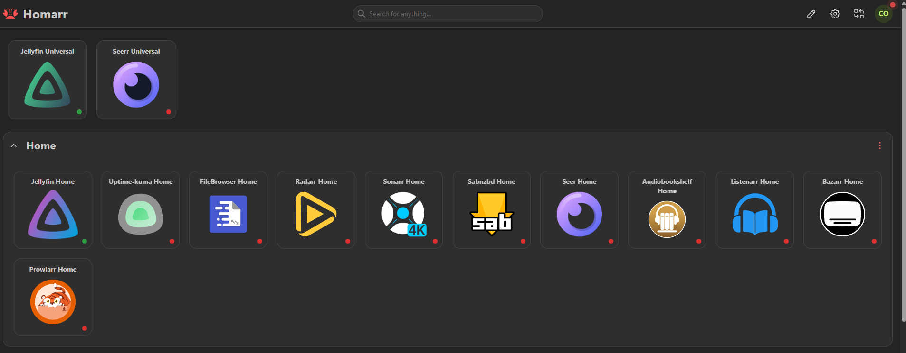
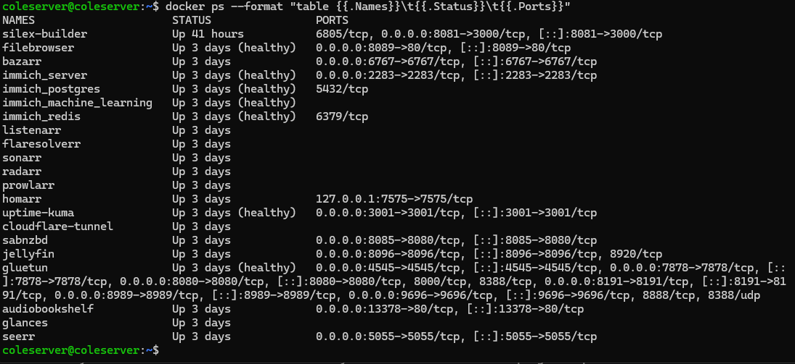
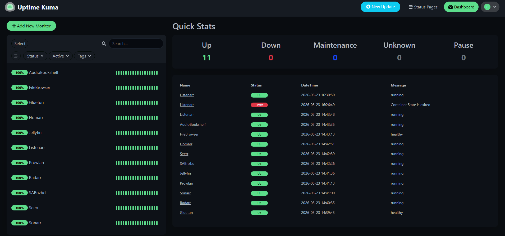
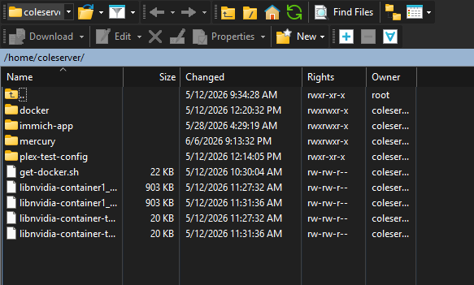

# Linux Server Project: Home Network Storage & Automated Microservices

This project is a headless Linux application server that manages local storage, automated file systems, and network services using Docker containers. The setup includes secure remote access via a reverse proxy tunnel and real-time uptime monitoring to ensure high availability.

---

## Technical Specifications & Tool Stack
* Operating System: Ubuntu Server (Headless LTS)
* Containerization & Virtualization: Docker / Docker Compose
* Network Security & Remote Access: Cloudflare Tunnels (No open inbound ports)
* Monitoring & Diagnostics: Uptime Kuma, Jellystat, PostgreSQL Database
* Storage Configuration: Local Ext4 storage arrays with persistent volume mapping

## Custom Hardware Configuration (Built & Maintained Locally)
* **CPU:** AMD Ryzen 5 2600X (6 Cores / 12 Threads)
* **RAM:** 16GB DDR4 Dual-Channel @ 3200MHz
* **GPU:** NVIDIA Quadro P1000 (Dedicated GPU passed through to Docker for hardware acceleration)
* **Storage:** 2x 3TB 7200RPM HDD mechanical drives (Dedicated local storage array)

---

## Core Project Features

### 1. Network Security and Remote Access
* Secure Tunneling: Configured a Cloudflare Tunnel to route external subdomains directly to specific internal Docker containers. This setup allows remote access from anywhere without opening ports on the local router, protecting the network from external port scans.
* Central Dashboard: Deployed a Homarr landing page that acts as a single point of access for all internal network services and admin tools.
 

### 2. Automated File Management and Permissions
* API Automation: Set up an automated pipeline where different services communicate via API keys to request, find, and download files without manual intervention.
* Linux Permissions: Managed directory structures using Linux command-line tools, setting strict user and group permissions (UID/GID matching) to ensure containers can modify files safely without compromising host security.

### 3. Systems Monitoring and Uptime Tracking
* Uptime Monitoring: Installed Uptime Kuma to run constant HTTP and TCP ping tests on all critical container ports, sending real-time alerts if a service goes down.
* Performance Logging: Connected an analytical dashboard backed by a PostgreSQL database to monitor server performance, network usage, and active connections.

### 4. Data Backup and Storage Integrity
* Persistent Storage: Mapped Docker volumes to keep configuration data separate from the actual operating system files. This prevents data loss when updating or replacing containers.
* Critical Data Backups: Implemented a dedicated local storage area to safeguard irreplaceable personal data, such as a large multi-generational family photo library, keeping it separate from standard media directories.

---

## Troubleshooting and Technical Resolution

### The Issue
Several remote users reported that specific high-definition files were failing to play entirely, throwing playback errors and crashing the media client stream. The server was failing to establish a stable connection for files containing complex multi-channel audio tracks (such as EAC3 and DTS).

### The Fix
Using the CompTIA A+ troubleshooting methodology, I investigated the issue systematically:
1. Checked live server performance using the Linux `htop` command and reviewed the application error logs during a failed playback stream.
2. Discovered that while the graphics card (NVIDIA Quadro P1000) was successfully processing the video layer, the server's background software was failing to process the complex audio formats.
3. Identified the root cause as a missing setting in the server's configuration, which blocked the CPU from converting unsupported audio tracks into a standard format (like AAC) that remote devices could play.
4. Resolved the problem by updating the Docker container settings to properly route audio processing. This allowed the server to automatically convert incompatible audio on the fly, fixing the crashes and restoring full access for all users.
